# Table of Contents
[TOC]
# 1 Introduction

## 1.1 Purpose

This section will give a brief introduction to Pets' Caregiver, including the background of the project, the detailed functions of the systems, the main characteristics of the application, and simple research into similar products.

## 1.2 Project Purpose

With the continuous improvement of the quality of life, more and more people begin to keep a pet. As the latest White Paper on China's Pet Industry indicates, the market size of pets has reached 206.5 billion in 2020. However, there’s still no one app in the market that provides complete medical services for pet owners. Therefore, we want to design an app for pet owners so they can obtain integral services for their pets. In addition, those who don't own a pet can also get recommendations and see cute animals from the Pet Community.

However, the key usability goal of this app is to provide a full range of medical services for pets. This function is still very rare and of great value in the market.

## 1.3 System Functions

This system includes the following functions:

- Medical Services: we design to set *pet grooming* and *pet diagnosis* for medical purposes. In the latter part, we will provide multiple consulting methods, including self-examination on pets, online consultation with doctors, making an appointment for door-to-door services, and reservation for an offline clinic. We even plan to provide home delivery services for timely medicine supply.

- Pet Community: a platform for pet lovers to share their loving pets and experiences of raising them. Besides, considering the current situation that many universities have stray animals on the campus, we plan to set up an area, especially for them, where we will connect with relevant campus clubs, raise crowdfunding for stray animals, and offer adoption services.

- Health Mall: in the Health Mall, we will provide a list of recommended items for loving pets, like health products, deworming medicine, food, etc.

- Personalized Profile: In each account, we will provide a pet profile for its owner, through which the owner can get personalized notification about the character of his pet(e.g. health condition, the characteristics of the breed)

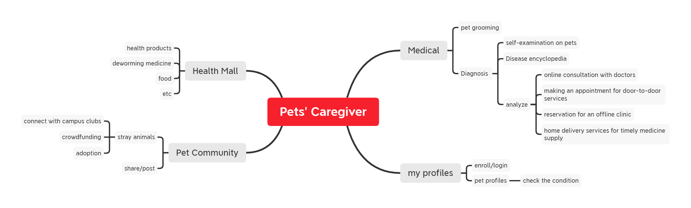

## 1.4 System Characteristics

- Door-to-door drug delivery services based on online consultation.

- Pet files construction to facilitate backtracking.

- A pet community as a communication platform.

- A crowdfunding platform for pet medical expenses.

- Cooperate with some universities' clubs to help build an aid platform for stray animals on campus.

- Build a user platform. Pet owners can set up files for their pets, according to which the platform will provide services like case analysis, regular reminders, and so on. 

## 1.5 Product Research

So far there is no such comprehensive app that specifies in pet-care on the market, but there are some similar products with imperfect functions, some of which is listed here:

- Pet Doctor (Shanghai PZP Network Technology Co., Ltd.): Provide online consultation for pet doctors, some basic knowledge related to pets, common parenting experience, etc.

- Pet Market (Shanghai Hongge Network Technology Co., Ltd.): Take pet secured transactions as the core, and extend other services like pet supplies, pet insurance, etc.

- Puppy At Home Pet Community (Puppy Home Information Technology Co., Ltd): Pet service community centered on pet foster care, beauty, and information sharing.

- Compared with the above pet service apps, our products are more targeted, and also realize the function of "medical treatment" very comprehensively. There are both beauty and diagnosis&treatment, both self-examination and consultation, both online and offline. Also, community service is provided for users to share tips for keeping pets, such as superior pet products and a caring experience. And you can buy relevant essential items for pet raising through the mall.

# 2 Use case modeling

## 2.1 Actor

The Actors in our product are mainly divided into four parts:

- **Administrator**. The Administrator has the highest power in the whole system, including user management, community governance, doctor certification, and so on.

- **Visitor**.The Visitor represents unregistered users in the system. They can view posts in the community, but can't interact in the community nor consult with doctors unless they register an account.

- **Registered User**

  This kind of user already has a legitimate account, and may has different categories as follows:

  - **Pet Doctor**: Certified doctors that are able to diagnose animals and make appointments.
  - **Store**: Sell goods and deal with feedback from customers.
  - **Pet Owner**: Registered accounts with a complete pet profile. They can seek help from veterinaries, as well as post in the community.
  - **Stray Animal Organization**: Users with a special authentication, representing that they are official organizations for stray animals. They have permission to post information about pets that can be adopted, and raise crowdfunding for homeless pets.

## 2.2 Agile Development and Requirement Analysis

- **User Persona**

To fully explore the functions of our application, we need to draw some user personas, which are archetypical users whose goals and characteristics represent the needs of a larger group of users. By attaining a deeper understanding of our audience, we can build a more exceptional and innovative product.

The pictures below describe some typical users.

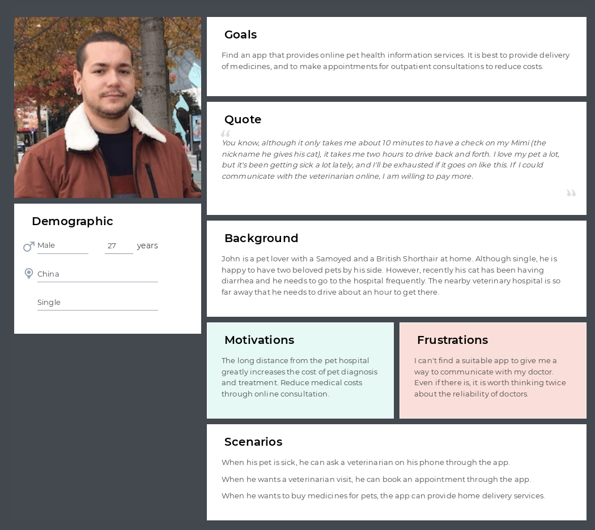

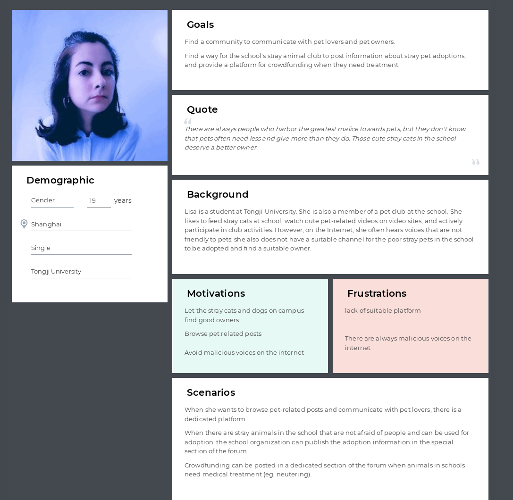

- User Stories
  -  One pet lover
    Once my pet gets sick, it is difficult for me to judge its symptoms and causes. There is little information about pet diseases on the Internet. It is also troublesome to go to the hospital for consultation. I really want a platform to help me when my pet is sick.
  - Another pet lover
    I often see stray animals in my city. Since nobody can distinguish them, we can't know when or where they need human help. Can there be any organizations helping us to manage those stray animals?
    I hope to provide a platform to help lost pets find their owners. Not long ago, I accidentally lost my dog while walking, and I haven't found it until now. It disturbed me a lot.
  - A pet doctor
    When I worked in the pet hospital, there aren't lots of pet owners visiting. Many pets cannot get effective treatment when they are ill for various reasons, such as convenience or price. I always think online consultation is a perfect alternative for offline treatment, because the owners can treat their pets by following the doctor's advice. All you need is to judge what kind of diseases the pet gets.
  - Campus pet club
    We often find injured pets on campus, but we lack relevant professionals to treat them. Even some experienced students find it difficult to determine the cause of pets. The evaluation of relevant pet products in the market is also deficient, so it is difficult for us to identify what is good.

- Enabler Stories
  - Provide a platform for pet owners to determine the diseases of pets. It should contain common pet diseases and their characteristics, as well as corresponding solutions.
  - Establish an online consultation system, where pet owners can consult pet doctors without visiting certain pet hospitals. Doctors can earn some medical expenses in this system.
  - Set up a special pet mall, which sells pet products only. And each customer can comment on the products for other buyers.
  - Give the public a platform to help stray pets find their owners where they upload the pets' photos and users can choose which pet to adopt.

## 2.3 Necessary Use Case Diagrams

This is an overall view of our product on top level:

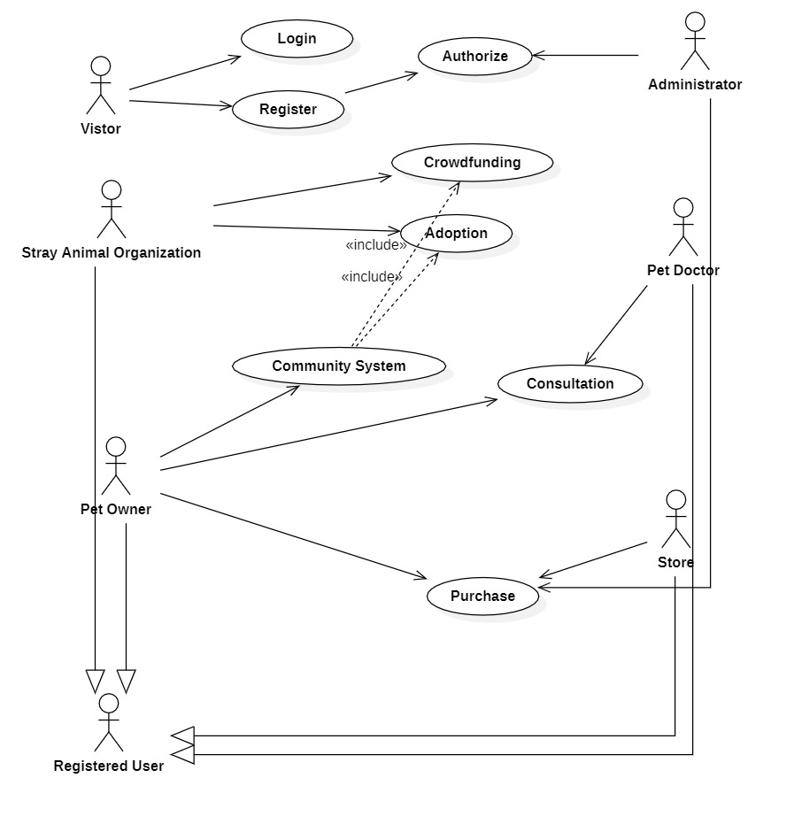

This is a more detailed view of the product:

## 2.4 Detailed Use Cases

1. Me

**Use Case Diagram**

**Detailed Specification for Use Case**

Use Case: Register

| **Use Case**         | **Register**                                                 |
| -------------------- | ------------------------------------------------------------ |
| ID                   | UC01                                                         |
| Specification        | Visitors register their own account and fill their own basic information;  System gives authorization according to the type of the account, including owners and stores. |
| Actors               | **Registered User, Administrator**                           |
| Pre-condition        | Visitors enter the login webpage for the first time and click "sign in". |
| Basic Path           | 1. Visitors enter the website.     2. Visitors click "sign up".   3. Visitors fill basic information:     3.1 Visitors fill cellphone number\email.     3.2 Visitors set username and password.    4. Visitors click "send verification code" and fill the code from text or email.   5. Visitors successfully create an user account. |
| Alternative Path     | 1.If the Visitor actually want to register as a store:   The information of the person above should be the director of the store and it still need to fill store name/store type and more rigorous and detailed person in charge information.   2. Visitors exit the webpage during the information filling system will show a notification:"Information filling incomplete, do you want to exit anyway?"    3. Visitors have problems during creating the account:    3.1 Visitors input illegal cellphone number\email\, system will show notification:"Sorry,illegal cellphone number\email\school ID"     3.2 Visitors don't receive verification code system will allow visitors to resend the verification code again after 60s countdown.  3.3 Visitors input wrong verification code system will show notification:"Sorry,wrong verification code,please input again." |
| Post-condition       | Visitors get their personal or store account and authorization. |
| special requirements | None                                                         |

Use Case: Login

| **Use Case**         | **Login**                                                    |
| -------------------- | ------------------------------------------------------------ |
| ID                   | UC02                                                         |
| Specification        | Registered User type account ID and password to login the account. System provides extend services such as retrieving password. |
| Actors               | **Visitors**                                                 |
| Pre-condition        | Visitors have their own authorized account.                  |
| Basic Path           | 1. Visitors enter the website.    2. Visitors click "login".   3. Visitors fill username and password into the webpage blanks.   4. Visitors successfully login. |
| Alternative Path     | 1. Visitors input wrong account information:     1.1 If Visitors input invalid account ID,  system will reject login,show notification"Sorry,account doesn't exist,please input again".  1.2 If Visitors input wrong password,  system will reject login,show notification "Sorry,wrong password,please input again".  1.3 If Visitors input wrong password for 5 times, system will ban visitors from logging in for 3 minutes.  2. Visitors click "forget password?" system will handle the request,send a verification code base on the account's cellphone number\email. Visitors can input the verification code and reset the password. |
| Post-condition       | Visitors enter the system, become Registered Users and can access more operations. |
| special requirements | None                                                         |

2. Communication System

**Use Case Diagram**

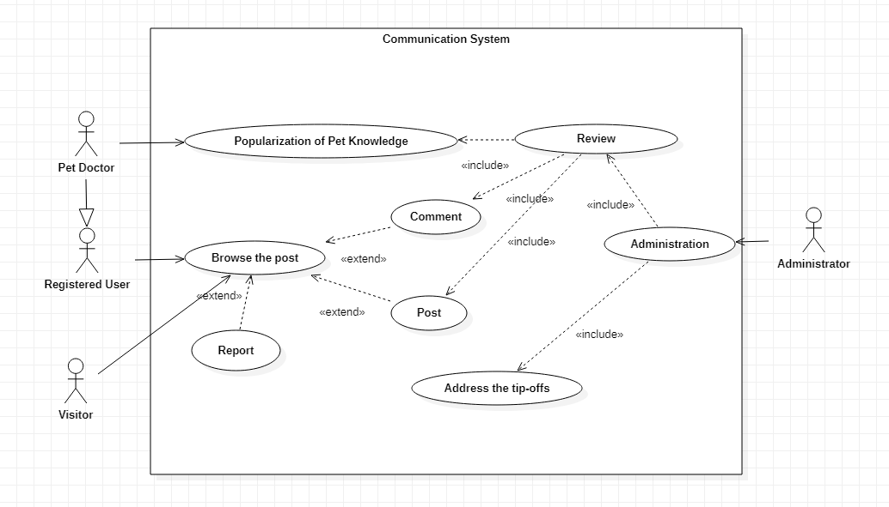

**Detailed Specification for Use Case**

Use Case: Communicate in this system

| **Use Case**          | **Communicate**                                              |
| --------------------- | ------------------------------------------------------------ |
| ID                    | UC03                                                         |
| Specification         | Allow all users to browse the post, make some comments and report some illegal information. Doctors can carry out additional dissemination of knowledge to website users. The administrator will process the reported information and review various comments and posts |
| Actors                | **Registered User, Pet Doctor, Administrator**               |
| Pre-condition         | User in the community webpage.                               |
| Basic Path            | 1. The use case starts when the User wants to browse the post to catch some information  2. The user can post, comment on some posts, and report some illegal information. Pet Doctors can publish some additional knowledge posts  3. The system sends these to the administrator  4. The administrator reviews these comments and posts      4.1 If the information is legal, publishing is permitted      4.2 If the information is illegal, publishing is rejected |
| Alternative Path      | 1. Users cannot find posts that interest them       1.1 Users can post such posts to get attention |
| Post-condition        | 1. User gets the information they need  2. User posts in anticipation of getting the information they need |
| Specific requirements | None                                                         |

3. Donate & Adopt System

**Use Case Diagram**

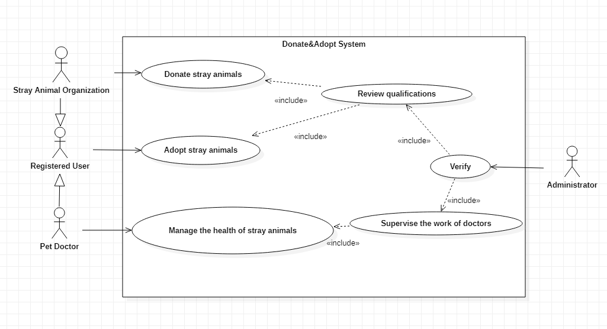

**Detailed Specification for Use Case**

Use Case: Donate stray animals

| **Use Case**          | **Donate**                                                   |
| --------------------- | ------------------------------------------------------------ |
| ID                    | UC04                                                         |
| Specification         | The **Stray** **A****nimal** **O****rganization** is allowed to donate stray animals, and the administrator is responsible for reviewing the qualification of the organization. |
| Actors                | **Stray Animal Organization**,**Administrator**              |
| Pre-condition         | The **Stray Animal Organization** on the community webpage.  |
| Basic Path            | 1. The **Stray Animal Organization** enters the stray animal donation webpage   2. The **Stray Animal Organization** provides qualification and identity certificates and donated animals.  3. The system sends these to the administrator  4. The administrator reviews the qualifications and certificates of the organization.      4.1 If the conditions are met, the donation is permitted      4.2 If the conditions are not met, the donation is rejected |
| Alternative Path      | None                                                         |
| Post-condition        | 1. The donation succeeds. The animals will be handed over to relevant doctors for health management.  2. The donation was rejected. |
| Specific requirements | The **Stray Animal Organization** must have sufficient proof of identity and qualifications |

Use Case: Adopt stray animals

**Use Case Diagram**

| **Use Case**          | **Adopt**                                                    |
| --------------------- | ------------------------------------------------------------ |
| ID                    | UC05                                                         |
| Specification         | All users are allowed to adopt animals, and the user's eligibility is reviewed by the administrator. |
| Actors                | **Registered User, Administrator**                           |
| Pre-condition         | User on the community webpage.                               |
| Basic Path            | 1. User enters the adoption webpage  2. User provides relevant personal information and the animal they want to adopt  3. The system sends these to the administrator  4. The administrator reviews the user's information as well as the animal's health conditon      4.1 If the conditions are met, adoption is permitted and the administrator informs the user about the general condition of the animal      4.2 If the conditions are not met, the adoption is rejected |
| Alternative Path      | None                                                         |
| Post-condition        | 1.The user adopts the animal successfully.  2.The adoption is rejected. |
| Specific requirements | Users need to have no bad records and certain personal identification. |

4. Crowdfunding System

**Use Case Diagram**

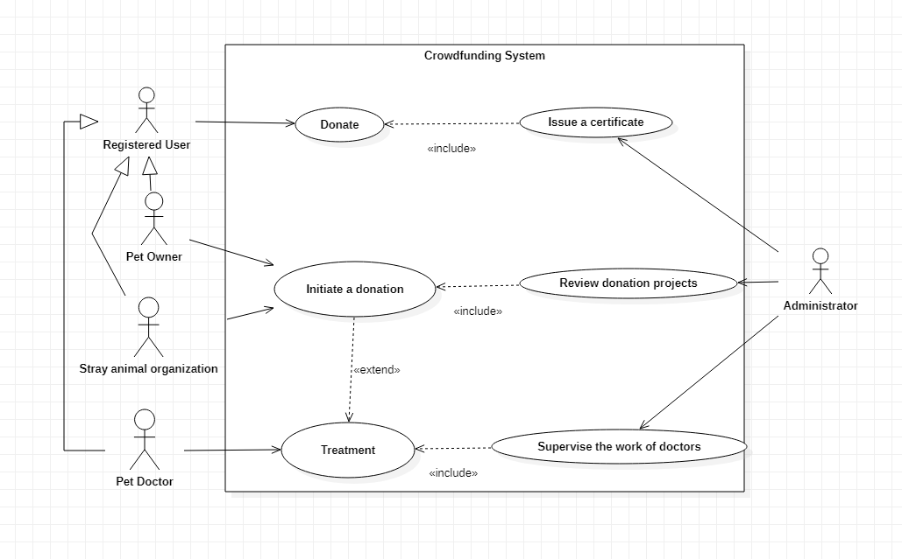

**Detailed Specification for Use Case**

Use Case: Initiate a donation

| **Use Case**          | **Initiate a** **Donation**                                  |
| --------------------- | ------------------------------------------------------------ |
| ID                    | UC06                                                         |
| Specification         | Pet Owners and Stray Animal Organizations are allowed to initiate a donation. The administrator will review the donation project. |
| Actors                | **Pet Owner**, **Stray Animal Organization**, **Administrator** |
| Pre-condition         | The **Pet Owner** or **Stray Animal Organization** on the community webpage. |
| Basic Path            | 1. The **Pet Owner** or **Stray Animal Organization** enters the crowdfunding-Initiate webpage   2. They provide relevant information and the current condition of the animal  3. The system sends these to the administrator  4. The administrator reviews the information as well as the animal's health condition     4.1 If the conditions are met, the donation project is allowed to initiate     4.2 If the conditions are not met, the project is rejected |
| Alternative Path      | None                                                         |
| Post-condition        | 1.The donation project is initiated successfully.  2.The project is rejected. |
| Specific requirements | The material provided by the **Pet Owner** or **Stray Animal Organization** needs to be true |

   Use Case: Donate

| **Use Case**          | **Donate**                                                   |
| --------------------- | ------------------------------------------------------------ |
| ID                    | UC07                                                         |
| Specification         | All users are allowed to donate to projects they want to help. And the administrator will issue a certificate to the user. |
| Actors                | **Registered User**, **Administrator**                       |
| Pre-condition         | The User on the community webpage.                           |
| Basic Path            | 1. The User enters the crowdfunding-donate webpage  2. The user provides personal information and the amount of money they want to donate  3. The system sends these to the administrator  4. The administrator reviewed the information.     4.1 If the conditions are met, the donation is allowed to be initiated,and the administrator will issue a certificate to the user.     4.2 If the conditions are not met, the donation is rejected. |
| Alternative Path      | None                                                         |
| Post-condition        | 1.The donation succeeds, and the user gets the donation certificate.  2.The donation is rejected. |
| Specific requirements | None                                                         |

5. Medical System

**Use Case Diagram**

**Detailed Specification for Use Case**

Use Case: Pet grooming

| **Use Case**          | **Pet Grooming**                                             |
| --------------------- | ------------------------------------------------------------ |
| ID                    | UC08                                                         |
| Specification         | The system will recommend various pet grooming shops to pet owners, and explain the details of each shop (such as location, price, grooming effect), pet owners can choose the one they like to groom their pets. |
| Actors                | **Pet Owner, Pet Grooming Shop**                             |
| Pre-condition         | Pet Owners has already filled out a pet profile.             |
| Basic Path            | 1. The Pet Owner enters the medical service area.  2. Pet Owners choose grooming services.  3. The system will recommend various pet grooming shops to the Pet Owner according to the pet file filled in by the Pet Owner and explain the details of each shop (such as location, price, grooming effect).  4. The Pet Owner can choose the favorite beauty shop according to the recommendation and description of the system and can communicate with the shop owner about the relevant situation. |
| Alternative Path      | 1. If the visitor is not registered, the system will remind the visitor to register an account first and fill in the relevant information.   2. If the user's pet file is not edited, the system will remind the user to fill in the pet file.   3. In the stage of tourists or Registered Users browsing pictures, if the picture cannot be loaded due to the user's network problem or server transmission failure, the system will prompt the user "Network failure, unable to load the picture". |
| Post-condition        | After users find their favorite beauty shop, the system provides an appointment service. Users can give feedback on the service on the system after making the perfect makeup for the pet. |
| Specific requirements | None                                                         |

Use Case: Pet physical examination

| **Use Case**          | **Pet Physical Examination**                                 |
| --------------------- | ------------------------------------------------------------ |
| ID                    | UC09                                                         |
| Specification         | The system will display a variety of symptoms that pets of this breed are prone to appear according to the pet file and attach a description of the relevant situation. At the same time, pet owners can also directly search for symptoms, and the system will provide relevant examples and explanations. |
| Actors                | **Pet owner**                                                |
| Pre-condition         | Pet owners need to register an account and fill out a pet profile. |
| Basic Path            | 1. The Pet Owner enters the medical service area.   2. Pet Owners choose diagnosis and treatment services.   3. The Pet owner chooses the pet symptom self-examination.   4. The system provides examples and descriptions of related symptoms (such as coat color, diet, activity), and Pet owners can also search directly. |
| Alternative Path      | 1. If the user is not registered, the system will remind the user to register an account first and fill in the relevant information.   2. If the user's pet file is not edited, the system will remind the user to fill in the pet file.   3. In the stage of tourists or registered users browsing pictures, if the picture cannot be loaded due to the user's network problem or server transmission failure, the system will prompt the user "Network failure, unable to load the picture". |
| Post-condition        | The system will provide Pet Owners with grooming or consultation services based on the results found. |
| Specific requirements | None                                                         |

| **Use Case**          | **Door-to-door Service**                                     |
| --------------------- | ------------------------------------------------------------ |
| ID                    | UC10                                                         |
| Specification         | The system will provide pet owners with door-to-door consultation and door-to-door medicine delivery services. This service requires pet owners to apply for door-to-door consultation or door-to-door medicine delivery to the doctor after online consultation, and to reach an agreement with the doctor, in which the system plays an intermediary role. |
| Actors                | **Pet Owner,  Pet Doctor**                                   |
| Pre-condition         | Pet Owners need to register an account, fill in pet files, provide a door-to-door address, and need to consult online. After communicating with the doctor, they can choose to have the doctor visit the doctor or deliver medicine to the door. |
| Basic Path            | 1. The Pet owner enters the medical service area.   2. Pet Owners choose diagnosis and treatment services.  3. Pet Owners need to choose online consultation.   4. After the online consultation, the Pet Owner can apply to the doctor for door-to-door consultation or door-to-door medicine delivery service.   5. If the doctor agrees to the door-to-door service, both the Pet Owner and the doctor need to fill in the agreement form and make a reservation application for the relevant service. |
| Alternative Path      | 1. If the user is not registered, the system will remind the user to register an account first and fill in the relevant information.   2. If the user's pet file is not edited, the system will remind the user to fill in the pet file.  3. During the stage of tourists or Registered Users browsing pictures, if the pictures cannot be loaded due to the user's network problem or server transmission failure, the system will prompt the user "Network failure, unable to load pictures". |
| Post-condition        | After the door-to-door service, users can give feedback on relevant information, and can make comments on the door-to-door service. |
| Specific requirements | None                                                         |

Use Case: Pet consultation

| **Use Case**          | **Pet Consultation**                                         |
| --------------------- | ------------------------------------------------------------ |
| ID                    | UC11                                                         |
| Specification         | The system provides online consultation and offline consultation services. Pet Owners can communicate with doctors online now. If necessary, they can also choose offline consultation. The system will search for nearby pet hospitals and assign them to the hospital. relevant information to pet owners. After choosing a hospital, Pet Owners can make an appointment directly on the system. |
| Actors                | **Pet Owner, Pet Doctor**                                    |
| Pre-condition         | Pet Owners need to register an account and fill out a pet profile. |
| Basic Path            | 1. The Pet Owner enters the medical service area.   2. Pet Owners choose diagnosis and treatment services.  3. Pet Owners can choose online consultation or offline consultation services.   4. If the Pet Owner chooses online consultation, the system will recommend multiple Pet Doctors to the Pet Owner, and the Pet Owner can choose a Pet Doctor for online consultation. If the Registered User chooses offline consultation, the system will search for nearby pet hospitals, and Pet Owners can make an appointment directly on the system after selecting a hospital. |
| Alternative Path      | 1. If the user is not registered, the system will remind the user to register an account first and fill in the relevant information.   2. If the user's pet file is not edited, the system will remind the user to fill in the pet file.   3. In the stage of tourists or registered users browsing pictures, if the picture cannot be loaded due to the user's network problem or server transmission failure, the system will prompt the user "Network failure, unable to load the picture". |
| Post-condition        | After the online consultation is over, the user can make relevant comments on the consultation situation, and can also comment on the doctor. After the offline consultation, users can give feedback and make comments on the hospital's services. |
| Specific requirements | None                                                         |

6. Health Mall

**Use Case Diagram**

**Detailed Specification for Use Case**

Use Case: Online Purchase

| **Use Case**          | **Online Purchase**                                          |
| --------------------- | ------------------------------------------------------------ |
| ID                    | UC12                                                         |
| Specification         | Registered Users purchase goods at health mall online.       |
| Actors                | **Registered User, Administrator**                           |
| Pre-condition         | Registered Users are located in the health mall to buy goods. |
| Basic Path            | 1. The user selects the desired product and clicks to enter the purchase page.   2. User select product specifications and attributes.   3. Click "buy now" or add the product to the shopping cart.   4. The user enters the settlement page and fills in the receipt information.   5. User orders and payments and funds are temporarily stored in the system platform account.   6. The system sends order information to the store.   7. The store delivers goods according to the order information. |
| Alternative Path      | 1. The user's purchase information is identified as wrong by the system:  The system will reject this purchase and remind the user of the wrong information.  2.The user's account for payment is abnormal, including insufficient amount and abnormal account status:  The system prompts the user to use other payment methods or cancel this purchase.   3.The user chooses to cancel the order before paying:  The system cancels the order and returns to the purchase page.   4.The store failed to deliver the goods on time  Inform the user of the situation and cancel the order. |
| Post-condition        | The user receives the goods successfully and the order is completed, the system will transfer the funds to the store. |
| Specific requirements | Users need to register and log in. The Administrator supervises the transactions. |

Use Case: After-sale Service

| **Use Case**          | **After-sale Service**                                       |
| --------------------- | ------------------------------------------------------------ |
| ID                    | UC13                                                         |
| Specification         | The user requests after-sales service for the purchased goods. |
| Actors                | **Registered User, Administrator**                           |
| Pre-condition         | Users have received the goods purchased in the health mall and need after-sales service. |
| Basic Path            | 1. The user enters the corresponding commodity order page.   2. The user clicks "after-sales service".   3. Users fill in the "after-sales service inquiry" form of the platform.   4. The system submits the after-sales service demand to the store.   5. The user negotiates the solution with the store.   6. Complete the service. |
| Alternative Path      | 1. Negotiation between the store and the user failed:  Send the report to the system administrator for review and adjudication.   2. The user chooses to withdraw the after-sales service:  The system automatically cancels the after-sales service process. |
| Post-condition        | Users tackle the problems about purchased goods.             |
| Specific requirements | Users must have purchase records of corresponding commodities. |

Use Case: Store Management

| **Use Case**          | **Store Management**                                         |
| --------------------- | ------------------------------------------------------------ |
| ID                    | UC14                                                         |
| Specification         | Store manage their store pages                               |
| Actors                | **Store, Administrator**                                     |
| Pre-condition         | Store has successfully registered                            |
| Basic Path            | 1. Enter the store management page   2. The store can choose to update the goods and change the poster operation.   3. Check user feedback and deal with after-sales problems   4. View business statistics |
| Alternative Path      | None                                                         |
| Post-condition        | The Store updated its stock, posters, etc.                   |
| Specific requirements | None                                                         |

## 2.5 Necessary Activity Diagrams

1. Apply for adoption

The **Registered User** provides personal data for the administrator to review. If the adoption conditions are met, users can further select the pets they want to adopt. Then the administrator checks the health of the animal. If the conditions are met, the adoption is successful. Otherwise, the user is required to reselect the pet.

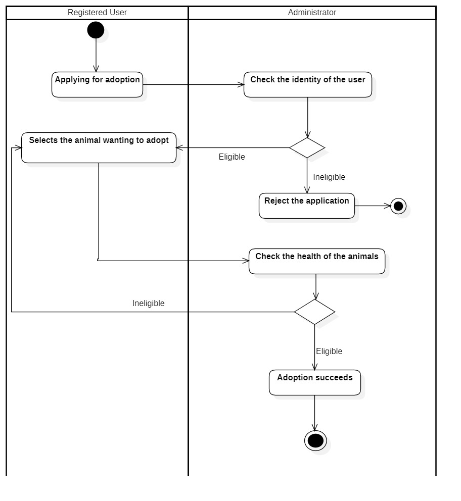

2. Initiate a donation

The **Pet Owner** or **Stray animal organization** provides their own relevant information, and the system submits it to the administrator for review. If the conditions for initiating donation are met, users are allowed to provide relevant project information. Then the administrator reviews the information to judge the authenticity of the project. If the conditions are met, the project is successfully initiated; otherwise, it fails.

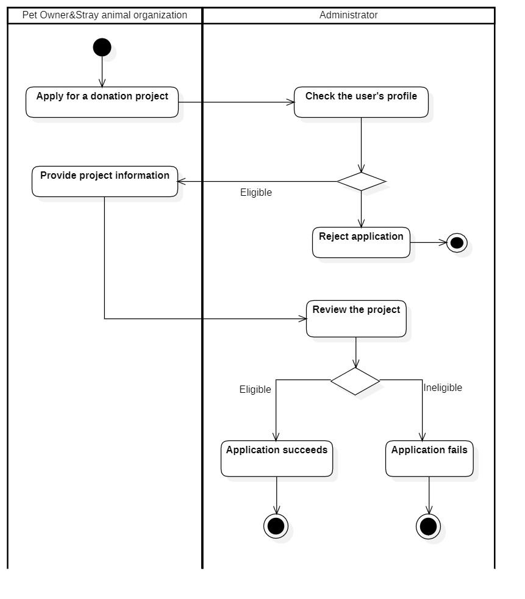

3. Purchase goods in the Health Mall

The User selects the goods and submits the necessary information, then pays for the goods he wants. The User will keep paying until he pays successfully and the money will be sent to the system and kept temporarily. Once the money has been sent, the system sends the information of the order to the store immediately, and the store begins to prepare the goods for the User. If anything is wrong during this section, the order will be cancelled by the system. Then the store should deliver the goods to the User and if the User is not satisfied with the goods or even doesn't get it, the after-sale service will be started. And if there is no agreement between the store and the User be reached, it needs the Administrator to judge and solve the problem.

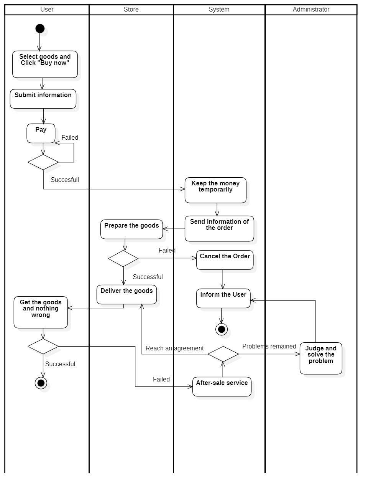

4. Register

A Visitor who wants to register and be a registered user needs to be checked if he/she has been registered already by the system. Then the visitor has to fill in enough information and choose the user type. If it is a normal personal user, then filling in the verification codes is the last step. While if it is a store or doctor, the visitor must get through the authentication of the Administrator, and after that, fill the codes. 

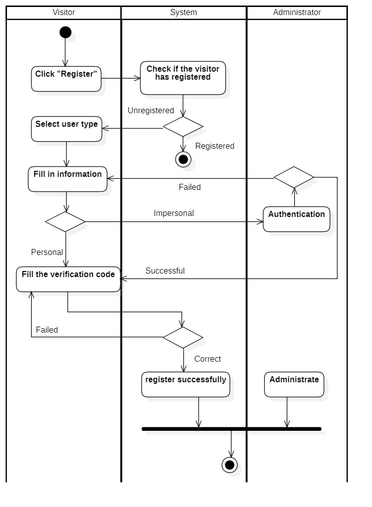

5. Pet grooming

When pet owners apply for pet grooming services, the system will recommend some pet grooming shops to pet owners. Pet owners can communicate with their favorite shops online. If pet owners are satisfied, they can make an appointment for the service and submit the service after doing pet grooming. feedback; if you are not satisfied, you can choose another pet grooming shop.

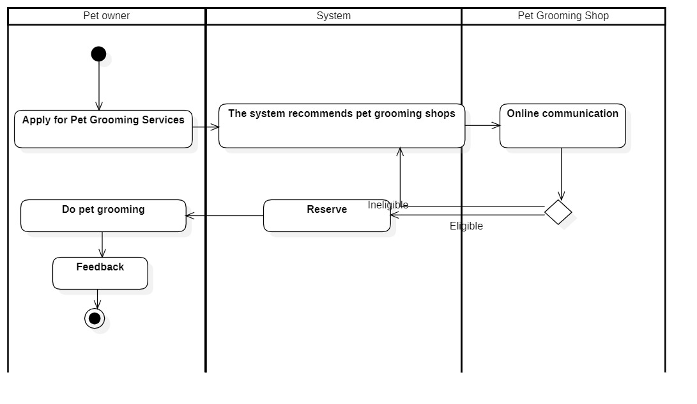

6. Pet medical

The pet owner consults online, and the doctor will inform the pet's condition. If the pet is in good condition, you can take care of yourself, the consultation is over and you can give feedback; if the pet is not in good condition, the doctor will suggest that the pet take medicine or consult a doctor. Pet owners can choose the method of purchasing medicine, and they can give feedback after the consultation. The consultation can be divided into on-site consultation and offline consultation. During the offline consultation, the system will recommend a pet hospital and have an appointment function. Submit feedback.

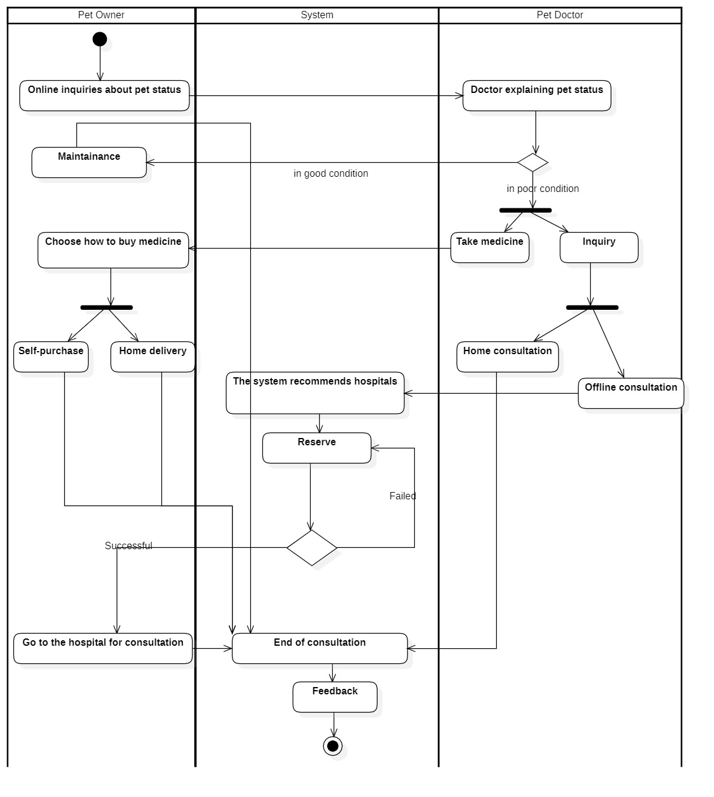

# 3 Glossary of Terms

| **Terms**                | **Definition**                                               |
| ------------------------ | ------------------------------------------------------------ |
| **Caregiver**            | Those who give pets care, including pet owners, pet societies or veterinarians. |
| **Visitor**              | Unregistered users of the system lack a series of permissions. |
| **Self-examination**     | The pet owner's pre-judgment of the pet's disease, by inquiring about the relevant information, or asking non-professionals to obtain a preliminary understanding of the pet's disease before seeing a veterinarian |
| **Online-consultation**  | By describing the pet's condition to the online pet doctor, handing it over to the doctor to diagnose the pet's condition, and execute the relevant doctor's orders. |
| **Health Mall**          | The shopping mall sells some pet related items, including some pet food and consumables. |
| **Store**                | The mall is composed of many stores, and each store needs to pass the audit to sell goods. |
| **Donation Project**     | A project issued to help animals in trouble raising funds, so that related specialists will do something for them. |
| **Crowdfunding**         | Call on animal lovers to raise funds to take care of lost animals. |
| **Pet Grooming**         | That is, pet cleaning, including bathing, shaving, beauty and other affairs |
| **Disease Encyclopedia** | Online pet disease atlas is used to help self diagnosis of diseases. |

# 4 Supplementary specification

This part will render some supplementary information about our project.

## 4.1 Performance

- The average response time of the system should be controlled at tps 50/200 ms,and no longer than tps 50/1000ms;
- The whole product must support more than 20,000 ordinary users and 80,000 visitors simultaneously.
- When some extreme situations occur, like abrupt increase in traffic, or failure of service, the system can perform an automatic or manual downgrade according to key data.

## 4.2 Reliability

- The bugs per KLOC should be less than 10.
- The system should run at least 98% of the time.

## 4.3 Security

- Only the administrator has access to maintain data.
- Users should be authenticated with a name and a password, in case of hostile attack from others.

## 4.4 Maintainability

- The product ought to have excellent expandable ability, so that appending of new functions will be convenient.
- The product should attach importance to completion of data and back up data at a fixed frequency.
- When a fatal bug occurs, the product should be able to rollback to previous version within 3 hours.

## 4.5 Usability

- The product must ensure that ordinary users can get a grasp of this platform easily.
- Guarantee the system's fault tolerance, which means that this system won't crash even if the user operates incorrectly.
- Keep the conciseness and consistency of the UI. Meet the CUA standard of IBM.

## 4.6 Design Constraints

The product should have the ability to run across different platforms to guarantee its platform commonality.

# 5 Mock-up UI

## 5.1 Login In

If users haven't logged into the system. They have to register by email, or just enter visitor pattern.

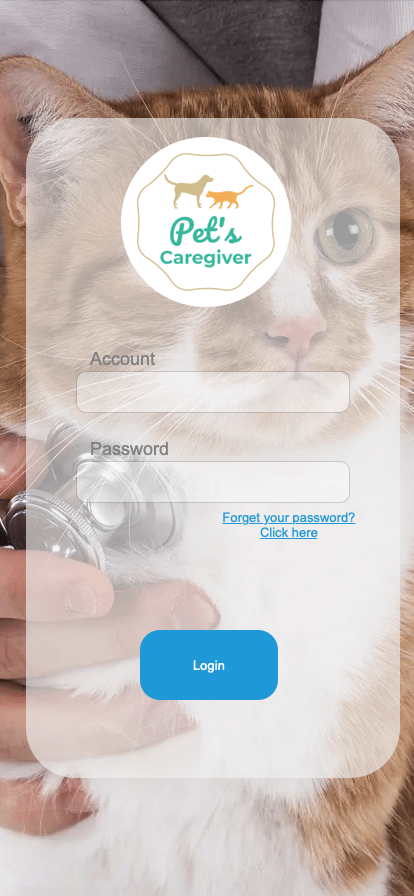

## 5.2 Main Page

On the main page, users can select various functions. The main function is diagnosis and treatment.

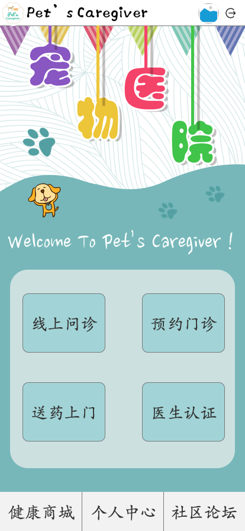

## 5.3 Medical Care

Before seeing the pet doctor, pet owners have to provide basic information about their pet and related symptoms. Then they select the pet doctor(vet). After that, they can ask doctors for diagnosis.

### 5.3.1 Pre-Inquiry

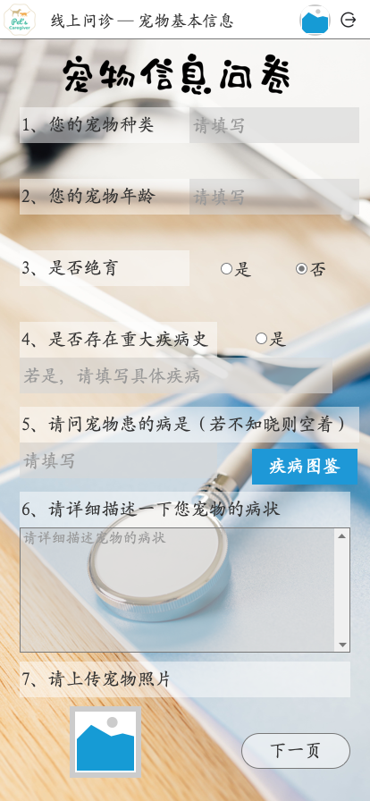

### 5.3.2 Doctor Selection

## 5.4 Pet Community 

### 5.4.1 Stray Pets

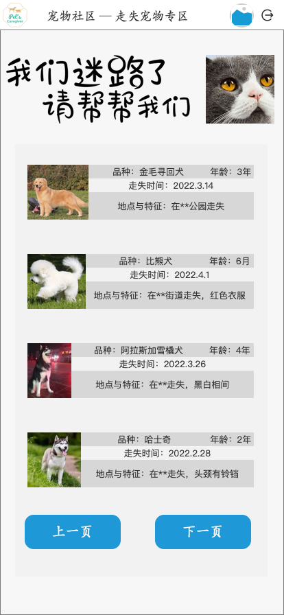

### 5.4.2 Share And Post

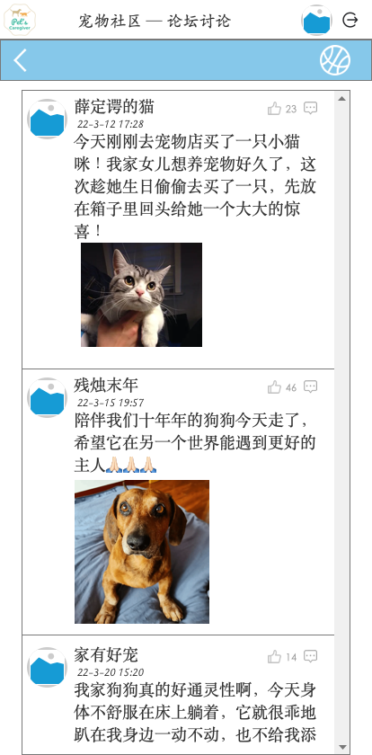

# 6 List of References

[1]*Systems Analysis and Design: An Object-Oriented Approach with UML*, Sixth Edition

In this book, the author introduces the core skills required to plan, design, analyze, and implement information systems. Apart from simply reading it, students can also gain knowledge about UML in the book, with a variety of examples of how SAD concepts are applied in real-life scenarios.

[2]*Wang Xuan, Gan Guojun, Wang Guanzheng, et al. Analysis on the Creation of a Pet Medical Service Platform of "Pampering for Life" in the New Retail Era [J]. Brand Research, 2020.*

This article indicates some phenomena about the pet medical services in our country and gives a feasible application to alleviate the situation, which has significant referential value.

# 7 Contributions of Team Members

In the process of completing this task, all team members participated in the discussion actively and forged ahead to complete their tasks. Our team members cooperate harmoniously, communicate and solve problems in a timely manner when encountering problems. The division of labor within the group is even and clear as follows:

- Introduction: written by [Baokker](https://github.com/Baokker)
- Use Case Modeling: The completion of this part is inseparable from the joint discussions and efforts of all team members. The detailed use cases and activity diagrams are written by [ssr123-ssr](https://github.com/ssr123-ssr)(Medical System), [Lucas123912](https://github.com/Lucas123912)(Communication System, Donate & Adopt System, and Crowdfunding System), and [JacksonW1025](https://github.com/JacksonW1025)(Me and Health Mall). The overall UML diagram is summarized by [Baokker](https://github.com/Baokker).
- Glossary of Terms: written by [Gxyrious](https://github.com/Gxyrious)
- Supplementary Specification: written by [Baokker](https://github.com/Baokker)
- Mock: designed by [Gxyrious](https://github.com/Gxyrious)
- List of references: written by [Baokker](https://github.com/Baokker)
- The PDF cover is made by [Gxyrious](https://github.com/Gxyrious)
- The final PDF is modified by [Baokker](https://github.com/Baokker)

| **Student Number** | **Name**      | **Score Weight** |
| ------------------ | ------------- | ---------------- |
|             | [Baokker](https://github.com/Baokker)  | 100%             |
|             | [Gxyrious](https://github.com/Gxyrious)     | 100%             |
|             | [JacksonW1025](https://github.com/JacksonW1025) | 100%             |
|             | [Lucas123912](https://github.com/Lucas123912) | 100%             |
|             | [ssr123-ssr](https://github.com/ssr123-ssr)   | 100%             |