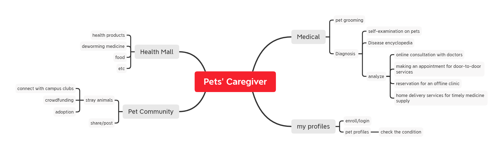

# 0 Table of Contents

[TOC]

# 1 Introduction

## 1.1 Document Usage

The purpose of the document is to illustrate the system's architectural analysis and analysis model. We also update previous use case models and render more snapshots with the advancement of our work, for better construction of the product. Besides, a brief description of annotated references is also provided. The last part introduces the contributions of our team members.

## 1.2 Project Background

With the continuous improvement of the quality of life, more people begin to keep a pet. However, there’s still no one app in the market that provides complete medical services for pet owners. Therefore, we want to design an app for pet owners so they can obtain integral services for their pets. In addition, those who don't own a pet can also get recommendations and see cute animals from the Pet Community.

However, the key usability goal of this app is to provide a full range of medical services for pets. This function is still very rare and of great value in the market.

## 1.3 Project Targets

This system includes the following functions:

- Medical Services: we set *pet grooming* and *pet diagnosis* for medical purposes. In the latter part, we will provide multiple consulting methods, including self-examination on pets, online consultation with doctors, making an appointment for door-to-door services, and reservation for an offline clinic. 

- Pet Community: a platform for pet lovers to share their loving pets and experiences of raising them. Besides, we set up an area especially for stray animals on the campus, where we will connect with relevant campus clubs, raise crowdfunding for stray animals, and offer adoption services.

- Health Mall: Provide a list of recommended items for loving pets, like health products, deworming medicine, food, etc.

- Personalized Profile: Provide a pet profile for each account, through which the owner can get personalized notifications about the character of his pet.

## 1.4 Progress and Current Status

In the first document, we have provided a detailed description of our product Pets' Caregiver, including some user persona, user stories, and the main use cases.

In this document, we will describe the project in terms of high-level architecture and some analysis models. 

Firstly, based on the traditional three-layer model, we design the layer architecture diagram of the system. Considering the cost of maintaining a multi-platform system, we separate different layers to reduce code duplication and development costs.x

Based on architecture analysis, we designed the main class diagrams and sequence diagrams, and after the discussion of the group, they are modified so that they could better express the logic of each system.

Last but not least, we have modified some of the previous use cases, and we also update snapshots of the system so they are more friendly and easy to use.

## 1.5 Glossary of Terms

| **Terms**                | **Definition**                                               |
| ------------------------ | ------------------------------------------------------------ |
| **Caregiver**            | Those who give pets care, including pet owners, pet societies or veterinarians. |
| **Visitor**              | Unregistered users of the system lack a series of permissions. |
| **Self-examination**     | The pet owner's pre-judgment of the pet's disease, by inquiring about the relevant information, or asking non-professionals to obtain a preliminary understanding of the pet's disease before seeing a veterinarian |
| **Online-consultation**  | By describing the pet's condition to the online pet doctor, handing it over to the doctor to diagnose the pet's condition, and execute the relevant doctor's orders. |
| **Health Mall**          | The shopping mall sells some pet related items, including some pet food and consumables. |
| **Store**                | The mall is composed of many stores, and each store needs to pass the audit to sell goods. |
| **Donation Project**     | A project issued to help animals in trouble raising funds, so that related specialists will do something for them. |
| **Crowdfunding**         | Call on animal lovers to raise funds to take care of lost animals. |
| **Pet Grooming**         | That is, pet cleaning, including bathing, shaving, beauty and other affairs |
| **Disease Encyclopedia** | Online pet disease atlas is used to help self diagnosis of diseases. |

# 2 Architectural Analysis

## 2.1 Detailed Architecture Analysis

Pets' Caregiver is a multiple platform application including IOS, ANDROID, and WEB. To facilitate the maintenance of multi-platform systems, we use the cross-platform framework flatter to build applications on each platform.

Due to the complex functions and large data flow of the system, if all the business logic is deployed in the application background, it will inevitably lead to low efficiency of the software. Due to multi-platform development, if all the business logic is written in the background of the application, it will cause a lot of repeated code, which is difficult to maintain and optimize. In addition, all applications operate on the same database, resulting in database performance bottlenecks. 

First, to simplify the computation in the application background, we want to split the application into several layers so that the lighter layers run in the application background and the heavier services are placed on the server. We then split the database so that all the persistence layers are isolated from each other and each service is responsible for them. This results in a structure similar to traditional three-layer architecture.

After that, we introduced a Message Queuing (MQ) mechanism. Since we use multi-service parallel processing architecture, the use of MQ can improve the performance of the service. Also, because of the peak times (shopping mall promotions, pet disease peak, expert visits, etc.), the large number of requests may cause the server to be difficult to carry, MQ effectively avoids the situation that the huge flow will cause a crash.

At the same time, due to the increase in the number of services and interfaces, the call relationship becomes complicated. In order to prevent data errors caused by permissions confusion, we add a layer of gateway between the application background and the service and conduct permissions verification every time the interface is called.

## 2.2 System-Level Architecture Design

Our architecture analysis is based on the traditional three-layer architecture, which is shown below:

On the basis of it, we redesign the architecture of the product by segmenting the system further. The picture below indicates our architecture analysis:

### 2.2.1 Presentation Layer

The presentation layer is the place where the end-user interacts with the application. Its main purpose of it is to display and collect information from users. After receiving the information from users, the layer can encapsulate the data and send it to the application layer for business logic processing.

### 2.2.2 Application Layer

In this layer, information from multiple platforms' presentation layers is unpacked and processed. Then the data will be sent to the business interface layer for logic processing. Apart from this, the layer also transfers data from the business interface layer to presentation layers for users.

### 2.2.3 Business Interface Layer

The business interface layer serves as the mediate between the application layer and business implementation layer. It transmits the data to call the corresponding business implementation layer to complete the business of the project and returns the message for transferring upwards. Besides, we subdivide the layer into several modules so the development and maintenance of the system will be easier.

### 2.2.4 Business Implementation Layer

Business implementation layer is the core of the whole system architecture, which deals with the business logic of the system. This part includes all relating business in the product, like Communication System, Donate & Adopt System, Medical System, etc.

### 2.2.5 Object Relational Mapping Layer

ORM (Object Relation Mapping)Layer mainly serves the Business Implementation Layer. It maps  **Entities** and **Tuples** in the database to **Classes** and **Objects**, which transforms database operations into an Object-Oriented style. That's helpful to improve the efficiency of the Business Implementation layer.

### 2.2.6 Data Access Layer

Data Access Layer is mainly responsible for data access, implementing various operations to data tables — Select, Insert, Update, Delete, etc. Although each service has its own distinctive database, they share one data access layer, because their operations towards database are same.

### 2.2.7 Data Resources Layer

Data Resources Layer is the most primitive part of the database. It is composed of a series of relational tables and is operated by Data Resource Layer. A single database may cause performance bottlenecks due to large amounts of application data. Therefore, multiple databases are designed to correspond with related services to speed up system operation efficiency

### 2.2.8 Common Service Layer

Some services that are related to all levels of components are contained in this Library, so that developing from all hierarchies can utilize them.

# 3 Analysis Model

## 3.1 Login And Registration

### 3.1.1 Class Diagram

### 3.1.2 Interaction Diagram 

## 3.2 Pet Grooming

### 3.2.1 Class Diadram

### 3.2.2 Interaction Diagram 

## 3.3 Pet Physical Examination

### 3.3.1 Class Diagram

### 3.3.2 Interaction Diagram 

## 3.4 Pet Medical

### 3.4.1 Class Diagram

### 3.4.2 Interaction Diagram 

## 3.5 Report

### 3.5.1 Class Diagram

### 3.5.2 Interaction Digram

## 3.6 Purchase

### 3.6.1 Class Diagram

### 3.6.2 Interaction Diagram

## 3.7 Initiate Fundraising

### 3.7.1 Class Diagram

### 3.7.2 Interaction Diagram

## 3.8 Sell Product

### 3.8.1 Class Diagram

### 3.8.2 Interaction Diagram

## 3.9 Adopt

### 3.9.1 Class Diagram

### 3.9.2 Interaction Diagram

# 4 Updated Use Case Model

> 

Compared with the previous version, we let the door-to-door consultation service include the door-to-door medicine delivery service, so that the two services are no longer independent, making users more convenient and fast.

# 5 Updated Snapshots of the System’s User Interface

| This page is the main screen of the application, which shows its main functions.  | This page displays personal information, including avatar, nickname, following, followers, likes and so on.  |
| ------------------------------------------------------------ | ------------------------------------------------------------ |
| This page shows the Lost pet interface in the pet community, which is used to help lost pet owners retrieve their pets.  | This page features the pet community, where many enthusiasts share their unique stories with their pets.  |
| This page is used for users to fill in their pet information.  | This page displays today's online physicians for users to choose who they want to see.  |
| This page shows a cat food product, including its price, information, shop information, etc.  | This page is another snapshot from the pet community, showing details of a blog, including likes and comments.  |

# 6 Annotated Reference

***[1] Systems Analysis and Design: An Object-Oriented Approach with UML, Sixth Edition***

In this book, the author introduces the core skills required to plan, design, analyze, and implement information systems. Apart from simply reading it, students can also gain knowledge about UML in the book, with a variety of examples of how SAD concepts are applied in real-life scenarios. 

When designing and analyzing several subsystems of this project, we make comprehensive use of the relevant technologies in the book, such as system architecture, use case analysis, class design and so on.

In the context of UML, this book focuses on the object-oriented method, and provides a logical, fast and comprehensive method to create a new system, so as to make a rapid response to our rapidly changing business environment. In the case of continuous maintenance, adjustment and redesign of complex information systems, object-oriented technology can play a good role.

Our development process has learned a lot of useful experiences from this book, such as scientific use case analysis, scientific timing communication analysis, and specific drawing of class diagrams.

***[2] Wang Xuan, Gan Guojun, Wang Guanzheng, et al. Analysis on the Creation of a Pet Medical Service Platform of "Pampering for Life" in the New Retail Era [J]. Brand Research, 2020.***

This article indicates some phenomena about the pet medical services in our country and gives a feasible application to alleviate the situation, which has significant referential value.

From the problems mentioned at the beginning of the article, we can know that there are many urgent problems to be solved in the pet medical environment in our country, such as the limitation of the number of medical places, the uncertain qualification of medical institutions, the limited timeliness of medical treatment, the weak health awareness of pet owners and so on.

In view of these problems raised in the article, when designing the whole pet diagnosis and treatment system, we start with some suggestions given in the article and start with these contradictions to analyze and design the system and classes. Through the convenience and universality of the mobile platform, pet services will be required.

This paper logically demonstrates the demand of the current pet medical beauty market for a widely used and recognized convenient mobile platform. Such a platform needs some public welfare nature, a more professional service team, and long-term trusted users. This provides more ideas for our design.

***[3] System Analysis and Design in a changing world. By: John W. Satzinger; Robert B. Jackson; Stephen D. Burd***

This book focuses on content that's most important to know with an emphasis on use case driven techniques for systems analysis and design. This edition introduces the most recent developments and tools, with expanded coverage of project management for adaptive projects and content reflecting Microsoft Project 2010. A new continuing case study and "Best Practices" feature provide even more opportunities for readers to apply the skills learned.

 Now readers can develop the solid conceptual, technical and managerial foundations needed for effective systems analysis design and implementation as well as the project management skills for systems development with SYSTEMS ANALYSIS AND DESIGN IN A CHANGING WORLD, 6E. This popular text teaches both the traditional (structured) and the object-oriented (OO) approach to systems analysis and design.

When we refer to this book, we focus on the design of "change". According to the complexity of the real situation, we require our system to adapt quickly and correctly to different changes. That is, we need to improve the robustness of the system. We refer to the specific design examples in the book for the design of robust graphs, so that the system can remain stable in the process of development and change. In the future, there will be more options for interaction with users and doctors and businesses settled on the platform.

# 7 Contribution of Team Members

In the process of completing this task, all team members participated in the discussion actively and forged ahead to complete their tasks. Our team members cooperate harmoniously, communicate and solve problems in a timely manner when encountering problems. The division of labor within the group is even and clear as follows:

- Introduction is written by [Baokker](https://github.com/Baokker)

- Architectural Analysis is written by [Gxyrious](https://github.com/Gxyrious) and [Baokker](https://github.com/Baokker)

- Analysis Model is written by [ssr123-ssr](https://github.com/ssr123-ssr) and [Lucas123912](https://github.com/Lucas123912)

- Updated Use Case Model is written by [ssr123-ssr](https://github.com/ssr123-ssr) and [Lucas123912](https://github.com/Lucas123912)

- Updated Snapshots of the System’s User Interface is written by [Gxyrious](https://github.com/Gxyrious)

- Annotated Reference is written by [JacksonW1025](https://github.com/JacksonW1025)

- The PDF cover is made by [JacksonW1025](https://github.com/JacksonW1025)

- The final PDF is modified by [Baokker](https://github.com/Baokker)

- The presentation PPT is written and presented by [JacksonW1025](https://github.com/JacksonW1025)

| **Student Number** | **Name**      | **Score Weight** |
| ------------------ | ------------- | ---------------- |
|             | [Baokker](https://github.com/Baokker)  | 100%             |
|             | [Gxyrious](https://github.com/Gxyrious)     | 100%             |
|             | [JacksonW1025](https://github.com/JacksonW1025) | 100%             |
|             | [Lucas123912](https://github.com/Lucas123912) | 100%             |
|             | [ssr123-ssr](https://github.com/ssr123-ssr)   | 100%             |