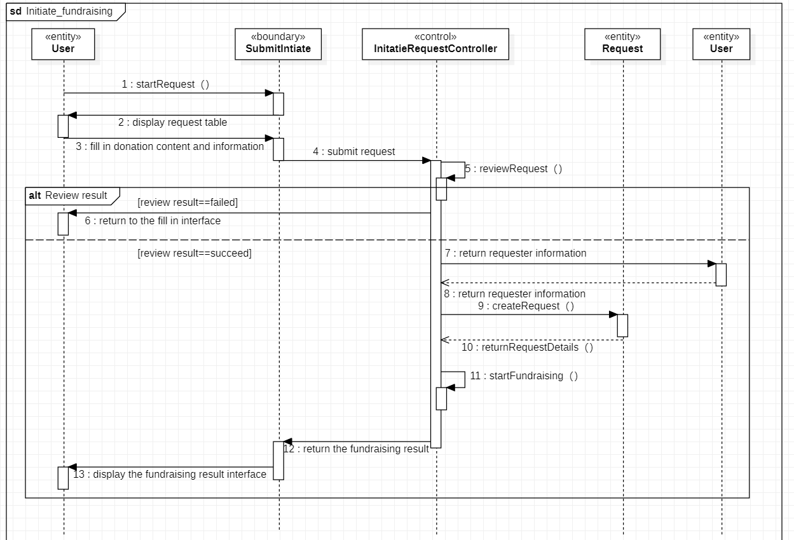

# 0 Table of Contents

[TOC]

# 1 Introduction

## 1.1 Document Usage

This document aims to give a more detailed description of our application based on previous results. We will introduce our application generally and refine our architecture into a platform-dependent one. After that, some design mechanisms, detailed use case realization, as well as architectural styles that are implemented, will be explained. Finally, we point out some possible problems and share some known and unknown in the project.

## 1.2 Project Background

With the continuous improvement of the quality of life, more people begin to keep a pet. However, there’s still no one app in the market that provides complete medical services for pet owners. Therefore, we want to design an app for pet owners so they can obtain integral services for their pets. In addition, those who don't own a pet can also get recommendations and see cute animals from the Pet Community.

However, the key usability goal of this app is to provide a full range of medical services for pets. This function is still very rare and of great value in the market.

## 1.3 Project Targets

This system includes the following functions:

- Medical Services: we set *pet grooming* and *pet diagnosis* for medical purposes. In the latter part, we will provide multiple consulting methods, including self-examination on pets, online consultation with doctors, making an appointment for door-to-door services, and reservation for an offline clinic. 

- Pet Community: a platform for pet lovers to share their loving pets and experiences of raising them. Besides, we set up an area especially for stray animals on the campus, where we will connect with relevant campus clubs, raise crowdfunding for stray animals, and offer adoption services.

- Health Mall: Provide a list of recommended items for loving pets, like health products, deworming medicine, food, etc.

- Personalized Profile: Provide a pet profile for each account, through which the owner can get personalized notifications about the character of his pet.


## 1.4 Progress and Current Status

In the last document, we illustrate the system's architectural analysis model, and update previous use case models. More snapshots were also rendered in the previous document.

In this document, we design the software design model of our project and update prototypes. Apart from this, we also describe some architectural styles and design mechanisms. These concepts assist us in the improvement of the system's quality. Last but not least, we refine our architecture, giving some examples of interface specification, and give two detailed use case realizations.

The main improvements to our system are as follows:

- By improving the originally planned framework, the performance of cross-platform performance is improved.
- Added detailed interface description, and also introduced some third-party interfaces that need to be used.
- Two design mechanisms are described, which help Spring Cloud's microservices and database access.
- Analyze the system as a whole, and adopt the appropriate architectural styles.
- Give descriptions of two use case realizations, integrating the design mechanisms as well as architectural styles.
- Try some prototyping to prove our ideas.

## 1.5 Glossary of Terms

| **Terms**                | **Definition**                                               |
| ------------------------ | ------------------------------------------------------------ |
| **Caregiver**            | Those who give pets care, including pet owners, pet societies or veterinarians. |
| **Visitor**              | Unregistered users of the system lack a series of permissions. |
| **Self-examination**     | The pet owner's pre-judgment of the pet's disease, by inquiring about the relevant information, or asking non-professionals to obtain a preliminary understanding of the pet's disease before seeing a veterinarian |
| **Online-consultation**  | By describing the pet's condition to the online pet doctor, handing it over to the doctor to diagnose the pet's condition, and execute the relevant doctor's orders. |
| **Health Mall**          | The shopping mall sells some pet related items, including some pet food and consumables. |
| **Store**                | The mall is composed of many stores, and each store needs to pass the audit to sell goods. |
| **Donation Project**     | A project issued to help animals in trouble raising funds, so that related specialists will do something for them. |
| **Crowdfunding**         | Call on animal lovers to raise funds to take care of lost animals. |
| **Pet Grooming**         | That is, pet cleaning, including bathing, shaving, beauty and other affairs |
| **Disease Encyclopedia** | Online pet disease atlas is used to help self-diagnosis of diseases. |

## 1.6 Description of Implementation Platforms and Frameworks

In the project, we will use microservice architecture to build the whole system. Through microservices, large applications can be decomposed into multiple independent components, and each component has its own responsibility areas. When dealing with a user request, the application of microservices may call many internal microservices to generate its response together.

We originally planned to use the Flutter framework. However, considering the performance, we finally decide to divide the cross-platform application into Flutter on the mobile application and Vue on the web application, improving performance through Nginx, and using Spring Cloud as the back end.

- Web Application: we use Vue, element-UI, and node.js to build web applications. Vue is a gradual framework for building user interfaces. Unlike other frameworks, Vue is designed to be applied from the bottom to up. The framework gains lots of popularity recently, for its simplicity in getting started, and convenience for the integration of third-party libraries or existing projects. Node.js shines in real-time web applications employing push technology over websockets.
- Mobile Application: Android and IOS applications are built with the platform Flutter. It is an open-source framework by Google for building beautiful, natively compiled, multi-platform applications from a single codebase.
- Server Framework: Spring boot is used as our microservices style back-end, due to its convenience in creating stand-alone, production-grade Spring-based Applications.
- Data Storage: we use Oracle to store user data.
- API Gateway: we use Nginx as the unified entry of the system, realizing the integration of various microservices, simultaneously shielding the complexity and differences of the system. Nginx has the characteristics of high stability and good performance.
- Security: To ensure the privacy and security of user information, we use Sa-Token to authenticate. It is a Java permission certification framework with comprehensive functions.

# 2 Architecture Refinement

## 2.1 Platform-dependent Architecture

In the previous architectural design, the design diagram we used is as follows:


After investigation, we found that the architecture has certain performance problems. To make the application work well on all three platforms -- IOS, Android and Web -- we originally planned to use the Flutter framework because it provides stable support for all three platforms. However, we found that the performance of the Flutter framework was not ideal on the Web side, so the architecture of the Web side application uses another architectural style, namely microservices.

After comprehensive comparison of advantages and disadvantages of various mainstream architecture designs, we decided to adopt the Flutter framework on the mobile end, Vue framework on the Web end, SpringBoot as the back-end framework, and the microservice architecture style based on SpringCloud. In order to ensure the security and stability of API interface invocation, we use Nginx as API gateway embedded in Vue to manage the invoking permissions of each resource of each client on API interface. For the API interface design, we follow a RESTful style to take full advantage of the HTTP protocol. For the internal implementation of API interface, we use the default implementation of Java Persistence API (JPA) in Spring Boot, that is to use the ORM framework named Hibernate for database data access.


For Presentation Layer, we use different frameworks for different platforms. Compared with other cross-platform frameworks such as React Native and NativeScript, Flutter has better performance and its performance is closer to direct Native platform development, which is relatively costly and difficult to maintain. Therefore, we finally choose Flutter as our mobile cross-platform framework. Although Flutter also supports Web applications. On May 12, 2022, it launched six stable cross-platform frameworks, but Flutter Web lacks performance, mainly because the system is not mature, and Web applications are more complex than mobile applications. So we abandoned the Web applications that Flutter supports, and turned to the Vue front-end framework. Therefore, our mobile applications (IOS and Android) adopt the Flutter framework and use the Brune component library. On the Web side we use the Vue framework and use the Element-UI component library.

We embed Nginx in the Vue framework and manage the API call permissions of client resources through token technology. Nginx provides a high performance gateway and uses asynchronous non-blocking event processing mechanisms, which have advantages over multi-threading.

The back-end design uses the micro-service style, because each service interface provided by our *Pet's Caregiver* is relatively independent, while each service of micro-service just satisfies high cohesion and low coupling between services. So we adopt SpringCloud microservice framework based on SpringBoot, which has core technology of microservice development, such as RPC remote call. Besides, SpringBoot Web component integrates SpringMVC by default, which can realize lightweight transmission of HTTP and JSON, so as to optimize the microservice interface.

For database-related operations in microservice interfaces, we use the ORM framework. Specifically, since the SpringBoot backend uses Java, the Hibernate framework that encapsulates lightweight JDBC is used to operate on the database.

## 2.2 Subsystems and Interfaces

### 2.2.1 Report System

Subsystem Name: ReportManagement

Interface: ReportManager

Details: The system is responsible for the submission of user reports, the review of reported content, and the feedback of reported content.

Interface functions:

1. submit report: 

	displaySubmitForm() : bool

2. create report:

	reportBuild(string reportID, string reportedID, string reporterID, string content, bool result) : bool

3. review report:
	
	viewReportContent(string reportID) : bool

4. get result:

	getReportResult(string reportID) : string

5. change user reputation score:

	changeCreditScore(string userID) : void

6. display result:

	displayReportResult(string reportID) : bool

### 2.2.2 Mall System

Subsystem Name: MallManagement

Interface: MallManager

Details: This system is responsible for solving the functions of users buying products, establishing product information, merchants listing products, establishing orders, processing order follow-up, and reviewing products in the mall.

Interface functions:

**ProductManagement:**

1. get product information:
	
	getProductInformation(string prductID) : string

2. keep product information:
	
	createProduct(string productID, string productName, string sellerID, string type, int price, string result) : void

3. change product information:
	
	changeProductInformation(string productID, string changeData) : bool

4. review product:
	
	reviewProductInformation(string productID, string storeID) : bool

5. purchase product:
	
	startPurchase(string orderID, string sellerID, time date, string productID, string buyerID) : void

**OrderManagement:**

1. create order:

	startOrder(string productID, string sellerID, string buyerID) : bool

2. process order follow-up:

	 processOrder(string orderID) : string

3. cancel order:

	deleteOrder(string orderID) : bool

### 2.2.3 Fund-raising System

Subsystem Name: FundraisingManagement

Interface: FundraisingManager

Details: This system is responsible for the application for donation by the seeker, the user initiates donation, the back end audits the donation, publishes the donation, provides the certificate, etc.

Interface functions:

**RequestManagement:**

1. request for fund-raising:

	startRequest(string requesterID, string requestContent) : bool

2. create request:

	createRequest(string requesterID, string requestContent, double requestAmount) : bool

3. review application:

	reviewRequestContent(string requestID) : bool

4. publish fund-raising:

	startFundraising(string requestID) : bool

5. get the details of the fund-raising:

	returnRequestDetails(string requestID, string userID) : string

**DonationManagement:**

1. start donation:

	createDonation(string userID, string requestID, double donationAmount) : void

2. review donation:

	reviewDonation(string donationID) : bool

3. provide certificate:

	offerCertificate(string userID) : void
### 2.2.4 Animal System

Subsystem Name: AnimalManagement

Interface: AnimalManager

Details: This system is responsible for the management of pets, including: relevant organizations provide animal information, users apply for pet adoption, doctors conduct pet health monitoring, and the system reviews relevant information, etc.

Interface functions:

**ProvideAnimalManagement:**

1. offer animal information:

	submitAnimalDetails(string subscriberID,string breed,string food,picture animalAppearence,string hobby) : void

2. create animal:

	createAnimal(string submitID) : bool

3. delete animal:

	deleteAnimal(string animalID) : bool

4. review subscriber's qualifications:

	reviewSubscriber(string subscriberID) : bool

**AdoptManagement:**

1. browse animal information:

	getAnimalDetails(string animalID, string userID) : string

2. apply for adoption:

	startAdoption(string userID,string animalID) : void

3. review user credit and animal health status:

	reviewCreditAndHealth(userID) : bool

4. create adoption:

	createAdopt(string userID, string animalID, string adoptInformation, string result) : void

5. Handling adoption follow-up:

	adoptFollowUp(string adoptID) : void

**AnimalHealthManagement:**

1. get animal health status:

	returnAnimalHealth(string animalID) : string

2. Check pet health:

	checkAnimal(string doctorID,string animalID) : string

3. review doctor qualification:

	reviewDoctor(string doctorID) : bool

### 2.2.5 User Management System

Subsystem name: UserManagerManagement

Interface class: UserManager

Function description: This subsystem handles all business involving user information change and reading.

Interface function:

1. register

	getRegistrationInformation(string nickName,string password,string telephone):bool

2. log in

	getLoginInformation(string userID,string password):bool

3. subscription

	getFollowed(string userID,string ID):bool

4. unsubscribe

	deleteFollowed(string userID,string ID):bool

5. log out

	logout(string userID):bool

6. Modify information

	modifyInformation(string userID ,string informationType, string information):bool

### 2.2.6 Pet Grooming Management System

Subsystem name: PetGroomingManagement

Interface class: PetGroomingManagemer

Function description: This subsystem provides pet beauty salons to obtain relevant information, view evaluations, contact, make appointments and other services.

Interface function:

1. get information

	getPetGroomingShopInformation(string shopID):string

2. view reviews

	browseReviews(string shopID):bool

3. chat

	createChatRoom(string userID, string shopID) : bool

4. book

	book(string userID, string shopID) : bool

5. feedback (like/comment)

	feedback(string userID, string shopID, string content) : bool

### 2.2.7 Pet Physical Examination Management System

Subsystem name: PetPhysicalExaminationManagement

Interface class: PetPhysicalExaminationManagemer

Function description: The system provides services such as online physical examination creation, keyword search, result display, solution generation, and feedback.

Interface function:

1. create service

	createPhysicalExamination(string userID) : bool

2. keyword search

	searchKeyWord(string content) : bool

3. show search results

	showSearchResults(string userID) : string

4. generate solutions

	generateSolutions(string userID) : string

5. feedback (like/comment)

	feedback(string userID,string content) : bool

### 2.2.8 Pet Medical Management System

Subsystem name: PetMedicalManagement

Interface class: PetMedicalManagemer

Function description: The system provides services such as creating services, obtaining information, viewing evaluations, inquiries, selections, appointments, and feedback on medical aspects.

Interface function:

1. create service

	createMedicalService(string userID) : bool

2. get doctor information

	getDoctorInformation(string userID,string PetDoctorID) : string

3. get hospital information

	getHospitalInformation(string userID,string hospitalID) : string

4. view reviews

	browseReviews(string PetDoctorID) : bool

5. inquiry

	createChatRoom(string userID,string PetDoctorID,string content) : bool

6. select pet doctor

	selectDoctor(string userID,string PetDoctorID) : bool

7. select hospital

	selectHospital(string userID,string hospitalID) : bool

8. book

	book(string userID,string PetDoctorID) : bool

## 2.3 Interface Specification

### Explanation

Since different roles participate in the platform, in order to ensure data privacy security and transmission efficiency during operation, the project should include security services such as login authentication, and only the login authentication interface is improved here. Considering the separation of front and back ends in the project development process, and security requirements such as authentication, we choose **Sa-Token**, a lightweight and powerful security framework, to provide system security services.

### Login Authentication

Since many operating interfaces in the community communication platform are restricted to access after login, login authentication is required before the interfaces that require login permission operations are executed. The Sa-token provides interfaces for querying the login status and token information parameters. This interface can be used to cut into other interfaces to perform corresponding operations.

| **API**                                     | **Introduction**                                             |
| ------------------------------------------- | ------------------------------------------------------------ |
| StpUtil.**getLoginRequest(string userID)**; | Mark the account id of the current session login.            |
| StpUtil.**logout()**;                       | Log out of the current session.                              |
| StpUtil.**isLogin()**;                      | Get whether the current session is logged in, return login state. |
| StpUtil.**checkLogin()**;                   | Check whether the current session has been logged in, if not logged in, an exception will be thrown: **NotLoginException** |
| StpUtil.**getLoginInformation()**;          | Get the login informattion of the current session,  if not logged in, an exception will be thrown: **NotLoginException** |
| StpUtil.**verifyLoginInformation()**;       | Check and verify login information, if not logged in, return **null** |
| StpUtil.**showInterfaceOfLoginFailure()**;  | Display the page after login failure,if login ,return **null** |

Take the user login interface as an example to show the process of calling the API:

During the login process, call the login interface to pass parameters as follows:

| **USERNAME** | **USERPASSWORD** |
| ------------ | ---------------- |
| testID       | tongjiSAD        |

Access the login interface through **URL: /api/Login?username=testID&password=tongjiSAD/** (The actual URL may be slightly different, the purpose here is to give an example). 

## 2.4 An Example

**Example Subsystem: Fund-raising system**

**Subsystem Name: FundraisingManagement**

**Interface: FundraisingManager**


### 2.4.1 RequestManagement

**startRequest(string requesterID, string requestContent) : bool**

This interface is called when the user wants to apply for fundraising. When the user fills in the relevant information form and submits it, the fundraising content is uploaded for the user.

**createRequest(string requesterID, string requestContent, double requestAmount) : bool**

This interface is called after the user submits the information, and the system sends the corresponding information and the HTTP request for constructing the request instance to the backend through the API according to the user's input, assigns an independent requestID to each request, and records it in the database.

**reviewRequestContent(string requestID) : bool**

This interface is called when the administrator is reviewing. When the administrator is viewing a fundraising application, it will call up the corresponding content according to the requestID through the back-end API. After the administrator has reviewed and determined, the result will be generated in the form of a JSON object, with An HTTP request with the corresponding requestID and the result is sent to the backend API. The API integrates the requestID and corresponding content into SQL and modifies it in the database.

```JSON
{
    "requestID":"requestID",
    "requesterID":"userID",
    "requestContent":"content",
    "requestAmount":"Aomunt",
    "requestResult":true/false,
}
```

**startFundRaising(string requestID): bool**

This interface is called when the administrator publishes the corresponding fundraising. When the administrator has completed the review and judges that a fundraising is in line with the facts, the interface is called, and the corresponding request is called according to the corresponding requestID, and the corresponding API is used to publish the fundraising content on the front end.

**returnRequestDetails(string requestID, string userID): string**

This interface is called when the corresponding request needs to be queried, and the requestID and the userID of the request query are sent to the background using the API. After reviewing the user's qualifications, send the corresponding HTTP request to the back-end API according to the corresponding result, and make the corresponding call.

### 2.4.2 DonationManagement

**createDonation(string userID, string requestID, double donationAmount) : void** 

This interface is called when the user applies for donation. The user enters the corresponding information, enters the userID, requestID and donationAmount and sends it to the database using the back-end API, assigns an independent donationID and stores it.

**reviewDonation(string donationID) : bool**

This interface is called when the administrator is reviewing. When the administrator is viewing a donation application, it will call up the corresponding content according to the donationID through the back-end API. After the administrator reviews and judges, the result will be generated in the form of a JSON object, with An HTTP request with the corresponding donationID and result is sent to the backend API. The API integrates the donationID and the corresponding content into SQL and modifies it in the database.

```JSON
{
    "donationID":"donationID",
    "donorID":"userID",
    "donationAmount":"Aomunt",
    "donationResult":true/false,
}
```

**offerCertificate(string userID) : void**

After the administrator checks the donation, when the donation is successful, the corresponding API is called according to the corresponding userID, and a donation certificate is sent to the user account, indicating that the donation is successful.

Activity Diagram about request initiation:



# 3 Design Mechanism

## 3.1 Spring Cloud Microservice Mechanism

- **Netflix Eureka**

Eureka server, also called service registry. Like other service registries, it supports a high availability configuration. Eureka is deployed in cluster mode. When a fragment in the cluster fails, Eureka goes into self-protection mode. It allows the discovery and registration of services to continue during shard failures, and when the failed shard recovers and runs, the other shards in the cluster will synchronize their state.

Eureka client, handles registration and discovery of services. The client service is embedded in the code of the client application through annotations and parameter configurations. While the application is running, the Eureka client registers its services with the registry and periodically sends heartbeats to renew its service lease. At the same time, it can also query the current registered service information from the server, cache them locally and periodically refresh the service status.

The high availability of Eureka Server is actually to register itself as a service with other registries. In this way, a group of mutually registered service registries can be formed to realize the synchronization of service lists and achieve a high availability effect.


- **Ribbon**

The Ribbon is a client load balancer based on HTTP and TCP. It can poll access through the `ribbonServerList` configured on the client to achieve service balance. When used in combination with Ribbon and Eureka, Ribbon's `RibbonServerList` instance will be rewritten by `DiscoveryEnabledNIWSServerList`, expanded from Eureka registry access to the server list. It also replaces `IPing` with `NIWSDiscoveryPing`, which delegates responsibility to Eureka to determine if the server is started.

- **Fegin**

Fegin's key mechanism is its use of dynamic proxies. Once the `@Feginclient` annotation is defined on an interface, when the interface is called, you are essentially calling the dynamic proxies created by Fegin. Fegin dynamically constructs the requested service address based on annotations such as `@RequestMapping` on the interface, and then initiates the request and parses the response to that address.

- **Hystrix**

In a microservice architecture, there are so many service units that if one unit fails, it is easy to spread the failure due to dependencies and eventually lead to the breakdown of the whole system. Such architecture is more unstable than traditional architecture. Hystrix uses the bulkhead pattern for thread pool isolation.It creates a separate thread pool for each dependent service, so that if there is too much latency for one dependent service, it only affects the invocation of that dependent service and does not slow down other dependent services.

## 3.2 Data Access Mechanism

In the process of API interface implementation, it is bound to increase, delete, change and check database access. Although Java provides the JDBC interface, it is not used directly in real development, which can lead to significant code complexity. Therefore, we use ORM technology to map relational tables in the database into classes and objects, so as to simplify the data access operation in the code.

Since we use Spring Boot as the backend design framework, and Hibernate has a good fit with it, which is one of the mainstream ways of Java Persistent Storage. Hibernate is a very lightweight object wrapper for JDBC and is a fully automated ORM framework that automatically generates and executes SQL statements.


Hibernate has six core Classes. They are Session, SessionFactory, Transaction, Query, Criteria, and Configuration. Through these interfaces, persistent objects can be accessed and transaction controlled.

- Configuration

The `Configuration` Class is used to configure start. During Hibernate startup, an instance of the `Configuration` first locates the mapping documents, reads these configurations, and then creates a `SessionFactory` object. Although the `Configuration` Class plays only a small role in the overall Hibernate project, it is the first object encountered when Hibernate is started.

- SessionFactory

The `SessionFactory` Class is responsible for initializing Hibernate. It acts as a proxy for the data store source and is responsible for creating the`Session`object. The factory model is used here. It is important to note that `SessionFactory` is not lightweight, therefore a project usually only needs one SessionFactory. When you need to operate on multiple databases, you can specify one `SessionFactory` for each database.

- Session

 A `Session` instance represents an operation with the database, created by the `SessionFactory`. `Sessions` are threads out of sync, which means they are unsafe, and can be used with `getCurrentSessiong()` to ensure that they are used in the same thread.

- Transaction

`Transaction` is mainly used for transaction management. It is a database transaction management interface that encapsulates underlying transactions. It is an optional API interface that you can choose not to use in favor of the underlying transaction handling code written by Hibernate's designers.

- Query

`Query` makes it easy to query databases and persistent objects. It can be expressed in two ways, HQL or SQL statements from a local database. `Query` is often used to bind query parameters, limit the number of query records, and ultimately perform the query operation.

- Criteria

`Criteria` is very similar to `Query`, which allows you to create and execute standardized object-oriented queries. It is worth noting that the `Criteria` is also lightweight and cannot be used outside of a `Session`.

Generally, Hibernate's workflow can be divided into the following steps:

1. Read the Hibernate configuration file and create an instance of the `Configeration` class.
2. Read and parse the mapping information of the `POJO` to create a `SessionFactory`.
3. Open `Sesssion`.
4. Create`Transation`.
5. Persistent operations, i.e. CRUD.
6. Commit the transaction.
7. Close `Sesstion` and `SesstionFactory`.

```Java
Configuration config = new Configuration().configure(); // Creating a configuration object
ServiceRegistry serviceRegistry =  new StandardServiceRegistryBuilder().applySettings(config.getProperties()).configure().build(); // Create a service registry object
sessionFactory = config.buildSessionFactory(serviceRegistry); // Create a SessionFactory object
session = sessionFactory.openSession(); // Create Session object
transaction = session.beginTransaction(); // Open Transaction

//session's CRUD：save(),update(),delete(),createQuery()
session.save(...);
......
transaction.commit(); // Commit transaction
// close connection
session.close();
sessionFactory.close();
```

# 4 Use Case Realization

## 4.1 Sell Interaction


Sell interaction covers the function realization process of goods construction, goods audit, goods sales query and real-time update when the merchant puts goods on the shelves。

As described above, in this system, we use ORM technology to map relational tables in the database into classes and objects. We have adopted this model in the process of calling store information and goods information. The steps are as follows：

**Application for sale of goods：**

The store first sends out a sales application, and the system provides a form for the merchant to fill in and then submits it to system. Then the system creates an instance of the `Configuration` class and reviews the content at the same time.

If the audit fails, a code of 101 will be sent to the system, indicating the failure result. The system will re-provide the form to the store to fill in.

If the audit succeeds, the system opens `Sesssion` and create `Transation` and the create query operations to get the store's information. After committing the operation, the DB returns it to the intermediate layer and closes `Sesstion` and `SesstionFactory`.Then the goods' information can be created and stored in the DB.

**Enquiring the sales result:**

The store first sends out a query application and the product's ID they want to consult. Then the system creates an instance of the `Configuration` class, opens `Session`, create `Transaction` and then creates query operations to get the goods' information. After committing the operation, the DB returns it to the intermediate layer and closes `Session` and `SessionFactory`.Then the goods' sales result will be returned to the store.


## 4.2 Login Interaction


The login interaction covers the login application, filling in login information, login failure processing, and successful login processing.

As mentioned above, in this system, we use ORM technology to map relational tables in the database into classes and objects. We employ this model in the process of invoking user information and logging in. The steps are as follows：

**Login:**

User enters username and password in a login form. The system then creates an instance of the `Configuration` class, where the information is checked for the correctness level of the input, that is, the system will reject login information with an illegal format (for example, empty username and empty password). Then the system will open `Session` and createTransaction and `getUserInformation()` to obtain the user's information, and verify that the password entered by the user is correct through `verifyPassword()`.

If it fails, the failure page will be displayed, but the user can enter the account password again to log in, but after three errors, the account will enter a frozen state.

If successful, the successful login page will be loaded.


# 5 Architectural Styles Used and Critical Design Decisions

## 5.1 Architectural Styles

Software architecture is the high level structure used for creating software systems, and proper architectural styles can:

- regulate all components' properties and constraints.
- set up the manners by which components interact. 

There are many different architectural styles proposed nowadays, each having different application scenarios, different strengths and weaknesses. The list below shows some architectural styles:

- Database-centric style. In this style ,data plays a crucial role in the whole structure. The data models precede the implementation of applications and remain valid even if the application is gone for a long time.
- Pipes-and-filters style. Each process is encapsulated within a filter component, and data is passed through multiple pipes for processing.
- Model-view-controller style. It divides the application to:
  - Model, which contains the core functions and data
  - View, which helps display the information for users
  - Controller, which tackles the requests and input from users
- Layered style. It decomposes the programs into groups of subtasks, each of which is at a particular level of abstraction. Most commonly, a system could be separated into four layers, including Presentation layer, Application layer, Business logic layer, and Data access layer.
- Client-server style. This style defines two parties: a server and multiple clients. The clients request services from the server, while the server provides the corresponding services to them. It is very appropriate for applications like emails.

In our system, we mainly adopt Layered style as well as REST architectural styles, which we will explain in detail in subsequent content.

### 5.1.1 Layered Style

The layered architecture style, otherwise known as the n-tier architecture style, divides the whole application into several layers. Each layer has a specific role and responsibility.

There are many advantages to this style. First, the framework will be simple and easy to implement. In addition, it reduces dependency among different parts, thus reducing coupling, and making testing individual components easier. The maintenance costs are also relatively low.

The figure below indicates a typical layered style method in software and the method of interactions between various levels.


Our system architecture is also created and modified with the above principle. The specific descriptions and system layer divisions can be found in Chapter 2.

### 5.2.1 REST Style

REST stands for REpresentational State Transfer. It's a software architectural style that defines some uniform rules web services. The style is useful for designing loosely coupled applications.

REST has six architectural constraints:

- Uniform Interface

- Stateless

- Cacheable

- Client-Server

- Layered System

- Code on Demand

On the basis of them, the REST requests that:

- REST is based on the resource(noun), instead of action(verb). Therefore, a URI(Uniform Resource Identifier) of a REST API(Application Programming Interface) should always end with a noun.

- HTTP verbs are used to identify the action, such as GET, PUT(it usually means updating data), POST, DELETE, etc.

The table below shows some examples of usage of REST:

| HTTP verb | URL     | Meaning                     |
| --------- | ------- | --------------------------- |
| GET       | /user/  | Return a list of users      |
| POST      | /user/1 | Create a user with ID=1     |
| PUT       | /user/2 | Update the user whose id==2 |

The REST style is easy to learn and implement and helps caching easier, thus gaining a lot of popularity in recent years. Our system will adopt this style to facilitate our coding, reduce the complexity of the program, and increase the response speed.

## 5.2 Critical Design Decisions

- In order to ensure the security and privacy of user data, we used Sa-Token as a framework for authority certification to guarantee the security of user information
- At first, we planned to use Flutter as a framework for cross-platform development. But considering the performance considerations of the web side, we finally decided to use Vue+Element UI on the web side for development to ensure performance.
- Use tools such as Netflix Eureka, and Ribbon to improve the speed of the back-end response, and at the same time balance the load.

# 6 Progress on Prototyping

## 6.1 Front-End Prototyping

We conduct a related exploration of the Flutter framework, read some [development documents](https://flutter.cn/docs) of Flutter, at the same time configure Flutter and the corresponding Android SDK on the computer, and installed Android Studio for editing code. In addition, we download and try to run the project [Flutter Gallery](https://github.com/flutter/gallery/) developed by Flutter. The project aims to help developers learn and use Flutter to make the Material style components (which are commonly used in Android) and the commonly used Cupertino style components (which are recommended in IOS). This helps us for further development at the front-end, and ensures the comfort of browsing.


| img1 |                         img2                          |
| :--: | :---------------------------------------------------: |
|      |  |

## 6.2 Back-End Prototyping

We use the SpringBoot architecture as the back-end of the Pet's Caregiver. To separate the front-end and back-end, we need to document the API in detail. The requirements are first described by the person in charge of each page of front-end, and then summarized by the back-end developer and written out the corresponding API documentation. API documentation provides relevant specifications (such as base address http://localhost:8080/api), and the function of each interface according to the type, each interface specifies the corresponding URL request path, the HTTP request type, parameters, and response. To facilitate front-end and back-end debugging, we use Swagger to visualize the back-end interface as an HTML web page for easier testing. Since SpringBoot is based on the Java language, we used IntelliJ IDEA as a development tool and Lombok and Maven plug-ins to simplify Java development.

|                         img1                          |                         img2                          |
| :---------------------------------------------------: | :---------------------------------------------------: |
|  |  |

We use an interface `getLoginInformation(OwnerID)`as a prototype shown below：

Request url: /api/Login; 

Request method: post;

Request parameter:

| name     | type   | remark   |
| -------- | ------ | -------- |
| userID   | string | not-null |
| password | string | not-null |

```Java
@Data
@Entity
public class User {
  @ID
  private String userID;
  private String password;
  private String telephone;
  private String address;
}
@Repository
public interface UserRepository extends JpaRepository<User, String> {
  User findUserById(string id);
  Itetable<User> findAll();
  long count();
  void deleteById(String id);
  void delete(User user);
}
@RestController
@RequestMapping("/api")
public class TestController {
  
    @Autowired
    UserRepository userRepo;
  
    @ResponseBody
    @PostMapping("/Login")
    public Boolean login(String userID, String password) {
        User user = userRepo.findUserById(userID);
        if(user == null || !user.getUserID().equals(user.getPassword())) {
            return false;
        }
        else {
            return true;
        }
    }
}
```
# 7 Open Issues in Design Model

- In the process of combining model design with subsystem instances, some incompatibilities between the two are encountered.
- In the process of prototype analysis and design, it is difficult to find the most appropriate example which is wide enough.
- When designing the architecture, it is difficult to consider all the details because it needs to be compared and selected according to the advantages and disadvantages of different frameworks.
- In the use case modeling, the grasp of details and the control of subjects still need to be considered.

# 8 Project Self-reflection

| **Known Knowns**                                             | **Known Unknowns**                                           |
| ------------------------------------------------------------ | ------------------------------------------------------------ |
| System function and architecture System interface Front end design Back end design | Consumer psychology Competitive products Fund management means |
| **Unknown Knowns**                                           | **Unknown Unknowns**                                         |
| UI design more in line with engineering psychology Interface beautification | Operation management mode Publicity and profit               |

## Known Knowns

We have made a detailed and complete design of the overall system function and architecture, implemented all necessary system interfaces, and given a complete front-end and back-end logic. From the perspective of system analysis and design, our design process is standardized and correct, and has been fully optimized.

## Known Unknowns

In fact, from the perspective of actual business, our system needs to take into account enough real business factors, including the consumer psychology of users when using our products, the competitive products of friends, and the fund chain management mode of the platform. These external realistic factors affect the specific operation mode of our system, and can help us conduct more detailed SWOT analysis, which needs to be combined with more management knowledge.

## Unknown Knowns

We have the ability to optimize the UI of our system more in line with engineering psychology, making our UI more suggestive and comfortable to use. At the same time, we also have the ability to beautify the operation interface. These works have not been focused on in this project and will continue to be optimized in the future.

## Unknown Unknowns

Fundamentally speaking, platform management is actually enterprise management. The organizational operation and management mode of the platform is actually the management mode of the enterprise. We did not specifically consider the management strategy of the enterprise, nor did we consider the means of publicity and profit, nor did we specifically define the public welfare nature of the platform. These aspects will be discussed and studied later.

# 9 Contributions

In the process of completing this task, all team members participated in the discussion actively and forged ahead to complete their tasks. Our team members cooperate harmoniously, communicate and solve problems in a timely manner when encountering problems. The division of labor within the group is even and clear as follows:

- Introduction is written by [Baokker](https://github.com/Baokker)
- Platform-dependent Architecture is written by [Gxyrious](https://github.com/Gxyrious)
- Subsystems and Interfaces are written by [Lucas123912](https://github.com/Lucas123912) and [ssr123-ssr](https://github.com/ssr123-ssr)
- Interface Specification and examples are written by [Lucas123912](https://github.com/Lucas123912) and [ssr123-ssr](https://github.com/ssr123-ssr)
- Design Mechanism is written by [Gxyrious](https://github.com/Gxyrious)
- Use Case Realization is written by [Lucas123912](https://github.com/Lucas123912) and [ssr123-ssr](https://github.com/ssr123-ssr)
- Architectural Styles Used and Critical Design Decisions are written by [Baokker](https://github.com/Baokker)
- Front-End Prototyping is written by [Baokker](https://github.com/Baokker)
- Back-End Prototyping is written by [Gxyrious](https://github.com/Gxyrious)
- Open Issues in Design Model and Project Self-reflection are written by [JacksonW1025](https://github.com/JacksonW1025)

- The final PDF is modified by [Baokker](https://github.com/Baokker)

- The presentation PPT is written and presented by [JacksonW1025](https://github.com/JacksonW1025)

| **Student Number** | **Name**      | **Score Weight** |
| ------------------ | ------------- | ---------------- |
|             | [Baokker](https://github.com/Baokker)  | 100%             |
|             | [Gxyrious](https://github.com/Gxyrious)     | 100%             |
|             | [JacksonW1025](https://github.com/JacksonW1025) | 100%             |
|             | [Lucas123912](https://github.com/Lucas123912) | 100%             |
|             | [ssr123-ssr](https://github.com/ssr123-ssr)   | 100%             |
